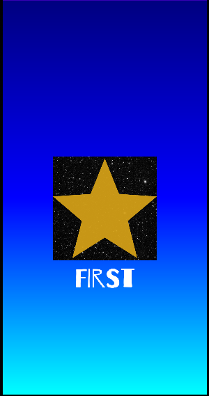
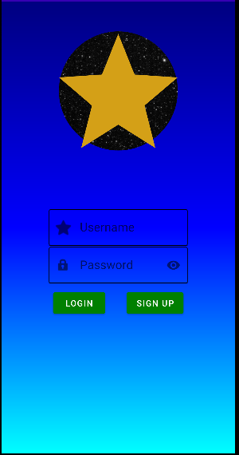
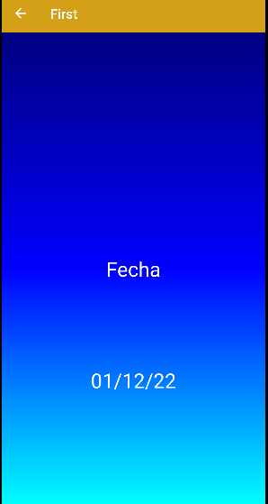
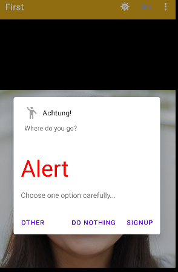
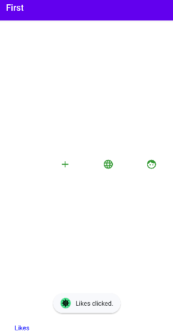
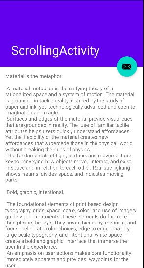

## I'm starting to edit the readme file of first

This is the **splash** of the activity in my app

## Login activity

This is the **result** of the login in my app

## Sign up activity

## Main activity

Main

Main bar

Sign out

Bottom navigation

## Scrolling activity

>This repository is licensed under
>[Creativecommons Org Licenses By Sa 4](http://creativecommons.org/licenses/by-sa/4.0/)