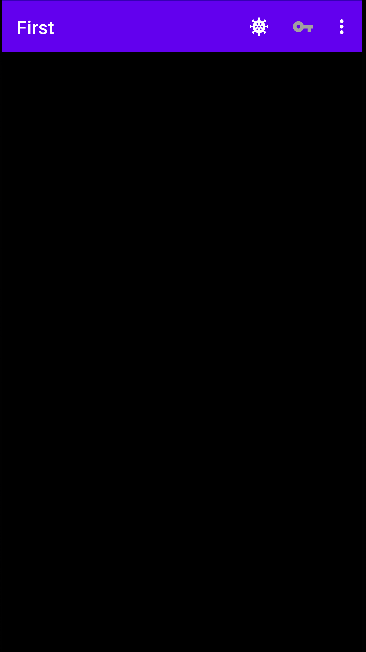

## I'm starting to edit the readme file of first

This is the **result** of the login in my app

>This repository is licensed under
>[Creativecommons Org Licenses By Sa 4](http://creativecommons.org/licenses/by-sa/4.0/)